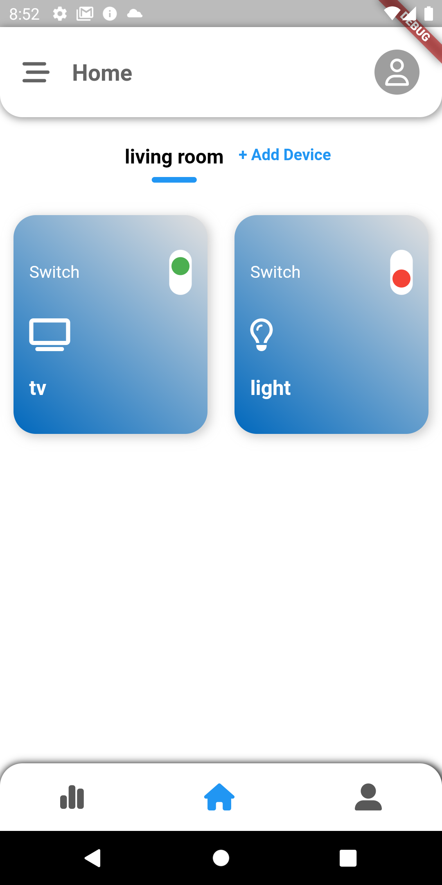
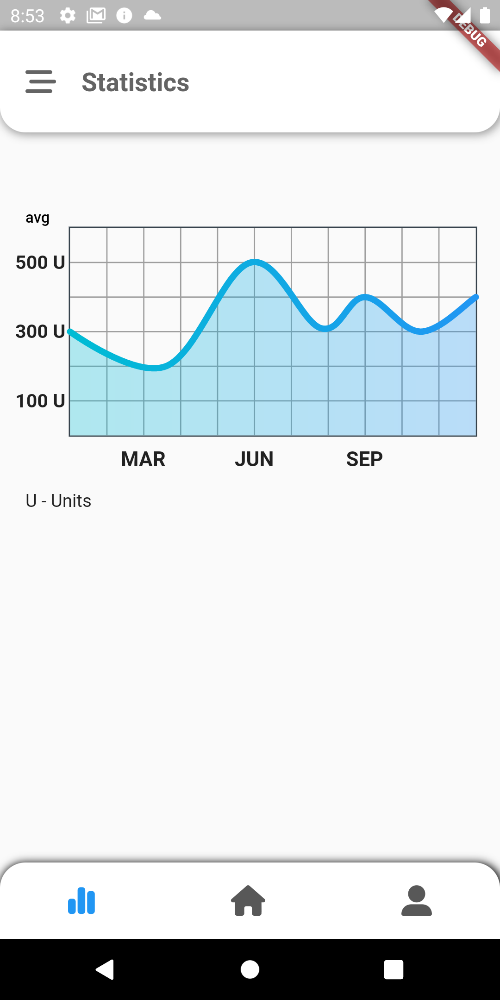
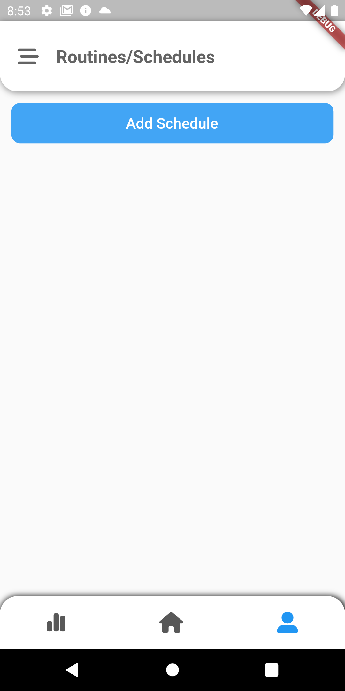
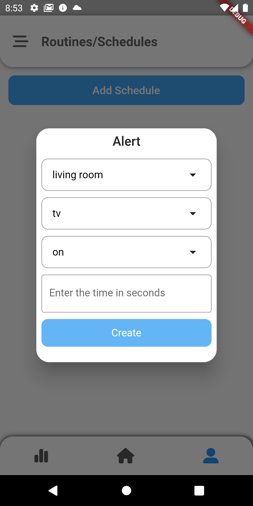
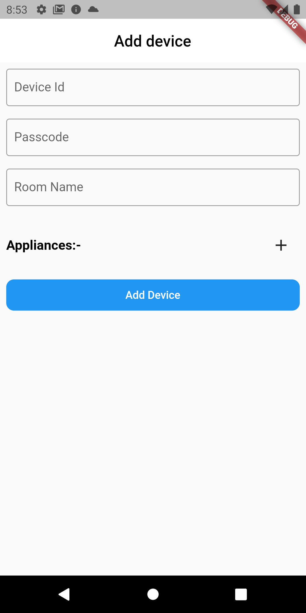

# HomeMate - A single solution for your to be automated

Homemate is multiple platform application which supports android,IOS,web,MacOS,Windows. Which is connected to the hardware i.e nodemcu through firestore realtime database and control the applications that are linked to the nodemcu

## TechStack Used

- Flutter
- Firebase realtime database
- Firebase authentication
- Firebase Storage
- Web side technologies to handle cron jobs

Homeautomation supports scheduling and routines

## Screenshots of amazing UI

